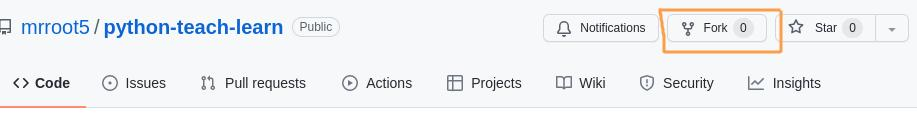
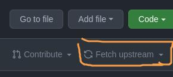

# Python teach and learn

This is a repository to teach and learn Python.

If you are a teacher, you can use all the exercises on this repo for your own purpose:
teach some concept, exams, etc.

As a student take a look to the explanations below.

## Requirements

* Python >= 3.6.
* Git installed.
* A GitHub account.

## Repo structure

On master you only have a few files, every exercise is inside his own branch.

Every branch has a name with index + what we learn.
For example the first branch is `0_hello-world`.
Also, we have modifications to the main exercise on a branch, example: `0.1_hello-someone`.
This modifications add more complexity to the main problem like is usually done on [code katas](https://en.wikipedia.org/wiki/Kata#Outside_martial_arts).

> Katas starts with a simple problem and will be more complicated on every step

## Step by step guide

If you fork this repo, never update the original branches because you could have conflicts in the future. Instead of that, create new branches.

### Step 0: Read it

Yes, this should be your first step, read this README and, of course, we start with 0 not 1.
If you do not know why, we will see it in the future, be patient.

### Step 1: Fork

You should fork this repo and then start working with it.
How? We will see a step by step guide with git commands.

If you use another tool like GitHub Desktop take a look to their docs.



### Step 2: Setup the upstream

This step is required to have the latests updates from the main repo in your forked one.

When you setup this you will be able to:

1. Update the master branch of your forked repo.
2. Get any new branch created from the main repo.

#### Add upstream remote origin

```shell
git remote add upstream git@github.com:mrroot5/python-teach-learn.git
```

#### Update branches

This could be done with the fetch button on GitHub:



Or with a git command:

```shell
git pull upstream master
```

Simply change master for the branch you want.
On GitHub you must change to a new branch to have the option to fetch it.

#### Update list of branches

I do not know if GitHub have an option to do this so, this is the command:

```shell
git fetch upstream
```
